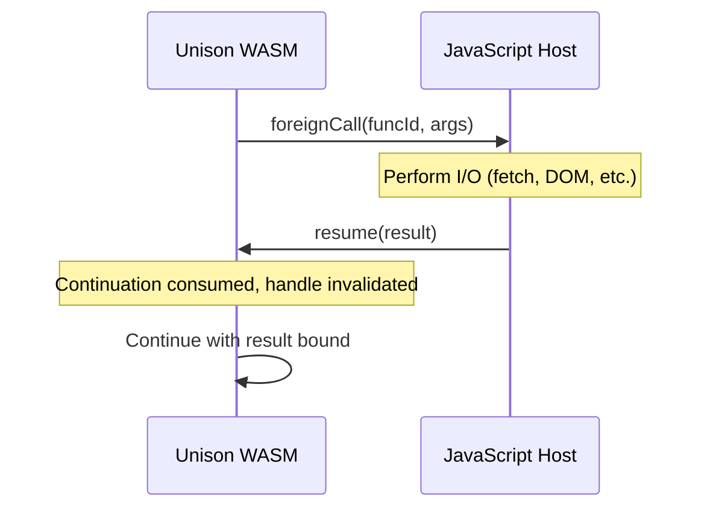

# WASM Compilation Backend for Unison

> **For AI agents:** See [`AGENTS.md`](../AGENTS.md) for codebase conventions, common pitfalls, and how to integrate with the existing Unison codebase.

---

## Terminology

To avoid ambiguity, we use these terms consistently throughout:

| Term | Definition |
|------|------------|
| `ForeignCall` | IR instruction that invokes a JS host function (may yield for async) |
| `Foreign` (object) | Heap object holding an opaque handle to a JS value (passive data, not a call) |
| `ContinuationHandle` | JS-side object for resuming an async `ForeignCall` (exactly-once) |
| JS host | The JavaScript environment embedding the WASM module |
| `K` | Continuation stack — linked list of frames in linear memory |
| `Push` frame | Return frame storing saved locals and return address |
| `Mark` frame | Ability handler marker frame |
| resume | Restore a captured continuation and continue execution |
| `TypeTag` | 8-bit discriminator for `TypedSlot` payload interpretation (`TYPE_*`) |
| `ObjTag` | 12-bit discriminator for heap object kind (`OBJ_*`) |
| `TypedSlot` | 16-byte (TypeTag + Payload64) pair — the universal value representation |

**Key relationships:**
- `ForeignCall` is the instruction; `Foreign` is passive data. Only `ForeignCall` can yield control.
- A captured continuation restores exactly the chain of `K` frames and the saved locals segments stored in those frames. There is no implicit operand stack.
- Pointers are 32-bit offsets into linear memory, stored zero-extended in the low 32 bits of `Payload64`.

For full ABI details, see [`WASM_ABI.md`](./WASM_ABI.md).

---

## Current Architecture Analysis

After examining the codebase, here is the existing compilation pipeline:


Key findings:
- **SuperGroup** ([`ANF.hs:1506`](../unison-runtime/src/Unison/Runtime/ANF.hs)) is the ideal IR stage for WASM targeting - it's lambda-lifted, in ANF, and backend-agnostic
- **Abilities use delimited continuations**, not CPS transformation - captured via `TShift` and handled via `THnd` patterns
- The native runtime uses a Haskell interpreter ([`Machine.hs`](../unison-runtime/src/Unison/Runtime/Machine.hs)) which serves as reference for WASM implementation

---

## Key IR Stage: SuperGroup

The `SuperGroup` type is the right target:

```haskell
-- unison-runtime/src/Unison/Runtime/ANF.hs:1503-1510
data SuperNormal ref v = Lambda {conventions :: [Mem], bound :: ANormal ref v}

data SuperGroup ref v = Rec
  { group :: [(v, SuperNormal ref v)],  -- mutually recursive bindings
    entry :: SuperNormal ref v          -- entry point
  }
```

ANormal terms use these patterns for control flow:
- `TApp f args` - function application
- `TMatch v branches` - pattern matching on sum types
- `TLets` - let bindings
- `TShift r v e` - capture continuation up to ability `r`, bind to `v`
- `THnd rs nh ah b` - install handler for abilities `rs`

---

## SuperGroup → WASM Lowering Rules (MVP)

This table defines the **mechanical translation** from ANormal nodes to WASM instructions. Each row is a deterministic rule — no interpretation required.

| ANormal Node | WASM Emission | Phase |
|-------------|---------------|-------|
| `TLit (N n)` | `i64.const n` | 1 |
| `TLit (I i)` | `i64.const i` | 1 |
| `TLit (F f)` | `f64.const f` | 1 |
| `TLit (C c)` | `i64.const (ord c)` | 1 |
| `TVar v` | `local.get $v` | 1 |
| `TPrm ADDN [a,b]` | emit(a); emit(b); `i64.add` | 1 |
| `TPrm SUBN [a,b]` | emit(a); emit(b); `i64.sub` | 1 |
| `TPrm MULN [a,b]` | emit(a); emit(b); `i64.mul` | 1 |
| `TPrm DIVN [a,b]` | emit(a); emit(b); `i64.div_u` | 1 |
| `TPrm EQLN [a,b]` | emit(a); emit(b); `i64.eq` | 1 |
| `TPrm LEQN [a,b]` | emit(a); emit(b); `i64.le_u` | 1 |
| `TLets _ [(v,_)] body cont` | emit(body); `local.set $v`; emit(cont) | 2 |
| `TApp (FComb ref) args` | emit(args...); `call $ref` (statically known) | 2 |
| `TMatch v branches` | emit(v); `br_table` on ObjTag/constructor | 3 |
| `TLit (T text)` | `call $allocText` with string data | 3 |
| `TCon ref tag args` | `call $allocDataN` based on arity | 3 |
| `TApp (FVar v) args` | `call $apply` (closure application) | 4 |
| `TApp (FPrim fop) args` | `call $fop` (builtin) | 4 |
| `THnd rs _ _ body` | push Mark frame; emit(body); pop frame | 5 |
| `TShift ref v body` | capture K to Mark; bind to v; emit(body) | 5 |
| `TFOp fop args` | `call $foreign_fop` (sync foreign) | 6 |
| `TFOp fop args` (async) | yield to JS with ContinuationHandle | 7 |

**Key rules:**
- In Phase 1-2, `TApp` is only allowed for statically-known functions (no closures).
- In Phase 1-2, no heap allocation occurs — only i64 locals and WASM operand stack.
- `TMatch` requires heap objects to exist (Phase 3+).
- `TShift`/`THnd` require K frames to exist (Phase 5+).

---

## Closure and Sum Type Representation

From [`Stack.hs`](../unison-runtime/src/Unison/Runtime/Stack.hs), closures are represented as:

```haskell
data GClosure comb
  = GPAp CombIx (GCombInfo comb) Seg      -- Partial application
  | GEnum Reference PackedTag              -- Nullary constructor
  | GData1 Reference PackedTag Val         -- Unary constructor
  | GData2 Reference PackedTag Val Val     -- Binary constructor
  | GDataG Reference PackedTag Seg         -- N-ary constructor
  | GCaptured K Int Seg                    -- Captured continuation
  | GForeign Foreign                       -- Foreign value
```

For WASM, these are represented as linear memory structures with versioned headers.

**See [`WASM_ABI.md`](./WASM_ABI.md) for the complete memory layout specification**, including:
- **Value terminology**: `Payload64` (raw 64-bit), `TypeTag` (8-bit discriminator), `TypedSlot` (16-byte TypeTag+Payload64 pair)
- **Pointer representation**: 32-bit pointers stored zero-extended in low bits of `Payload64`
- Object header format with version bits
- Layout for each closure variant (including `Text`, `Bytes`, `Sequence`)
- `GCaptured` stores both K pointer AND captured values (Seg)
- Stack frame and continuation (`K`) frame layouts
- Foreign handle table for JS interop
- Alignment requirements

---

## Ability Compilation: Two Categories

Unison's abilities are NOT compiled via CPS. Instead, they use **delimited continuations**:

1. `THnd rs nh ah b` installs handlers, pushing a `Mark` frame onto continuation stack `K`
2. Ability requests (`FReq`) look up handler in dynamic environment (`DEnv`)
3. `TShift r v e` captures the continuation up to the handler and binds it

### Key Insight: Most Abilities Run in WASM

The runtime already distinguishes between:

| Category | Mechanism | Where it Runs |
|----------|-----------|---------------|
| **Unison-defined abilities** | `DEnv` lookup → Unison handler | Entirely in WASM |
| **Foreign operations** | `ForeignCall` instruction | Yield to JS host |

From [`Machine.hs:1437-1440`](../unison-runtime/src/Unison/Runtime/Machine.hs):
```haskell
resolve env (HEnv aenv denv) _ (Dyn i)
  | Just v <- EC.lookup i denv = pure v  -- Unison handler found!
  | Just (ARef r) <- EC.lookup i aenv = BoxedVal <$> readIORef r
  | otherwise = unhandledErr "resolve" env i
```

### What This Means

**User-defined abilities run entirely in WASM:**
```unison
structural ability Counter where
  inc : () -> Nat
  get : () -> Nat

-- This handler is pure Unison code — no JS involved
Counter.run : '{Counter} a -> a
Counter.run program =
  go count = cases
    {a} -> a
    {inc () -> k} -> handle k () with go (count + 1)
    {get () -> k} -> handle k count with go count
  handle !program with go 0
```

**Only foreign builtins need JS:**
- `IO.printLine`, `IO.readFile` → yield to JS
- `Fetch.get`, `Dom.render` → yield to JS (browser-specific)
- Custom browser abilities with Unison handlers → run in WASM

### Three Runtime Categories

```
┌─────────────────────────────────────────────────────────────────┐
│                         WASM Runtime                             │
├─────────────────────────────────────────────────────────────────┤
│                                                                  │
│   Pure user abilities (Counter, State, Parser)                   │
│     → Unison handler in DEnv → execute in WASM                   │
│                                                                  │
│   Browser-only abilities with Unison handlers (custom UI state)  │
│     → Unison handler in DEnv → execute in WASM                   │
│                                                                  │
│   Foreign operations (ForeignCall instruction)                   │
│     → IO builtins, browser APIs → yield to JS host               │
│                                                                  │
└─────────────────────────────────────────────────────────────────┘
```

### Yield/Resume for Foreign Calls Only

For the subset that needs JS host interaction:



Implementation approach:
1. `ForeignCall` instructions compile to WASM imports
2. JS provides implementations of these imports
3. For async operations, WASM yields with continuation already saved in `K`; JS calls back to resume
4. Unison-defined abilities compile normally with manual delimited control in WASM

---

## Foreign Call Semantics (Critical Constraints)

The interaction between delimited continuations and async foreign calls is the most dangerous part of the design. When WASM yields to JS with a captured continuation, JS holds a reference to something Unison's type system cannot track.

### The Problem

```
TShift → captured continuation → ForeignCall → async resume
```

Without strict rules, this allows:
- **Reentrancy bugs**: Other events fire while waiting for async
- **Duplicated continuations**: JS resumes the same continuation twice
- **Invalid stack restoration**: State changed between capture and resume

### MVP Constraints (Non-Negotiable)

| Constraint | Rationale |
|------------|-----------|
| **Continuations are linear** | Exactly-once resume; matches Unison semantics |
| **JS enforces exactly-once** | Runtime error on double-resume |
| **No nested async before resume** | Prevents reentrancy |
| **Sync foreign calls are unrestricted** | No continuation crosses boundary |

### Foreign Call Categories

| Category | Behavior | Example |
|----------|----------|---------|
| **Sync** | Returns immediately, no yield | `Math.sin`, `Date.now` |
| **Async-linear** | Yields, resumes exactly once | `fetch`, `setTimeout` |
| **Async-cancellable** | (Future) Can be cancelled | Streaming, WebSocket |

For MVP, only **sync** and **async-linear** are supported.

### JS Runtime Contract

```javascript
// JS runtime must enforce these invariants:

class ContinuationHandle {
  constructor(wasmResume, continuationId) {
    this.wasmResume = wasmResume;
    this.continuationId = continuationId;
    this.consumed = false;
  }

  resume(result) {
    if (this.consumed) {
      throw new Error('Continuation already consumed (exactly-once violation)');
    }
    this.consumed = true;
    this.wasmResume(this.continuationId, result);
  }
}

// Async foreign call implementation pattern:
async function foreignFetch(runtime, url, continuation) {
  try {
    const response = await fetch(url);
    const text = await response.text();
    continuation.resume(runtime.allocText(text));  // exactly once
  } catch (e) {
    continuation.resume(runtime.allocFailure(e));  // exactly once (error path)
  }
  // continuation is now consumed; any further use is an error
}
```

### What Happens on Violation

| Violation | Detection | Behavior |
|-----------|-----------|----------|
| Double resume | JS runtime check | Throws `ContinuationConsumedError` |
| No resume (leak) | (Future) GC weak refs | Log warning, eventually collect |
| Nested async | WASM runtime check | Throws `NestedAsyncError` |

### Future Relaxations

Once MVP semantics are stable, we may explore:
- Multi-shot continuations (explicit cloning)
- Nested async with proper reentrancy guards
- Cancellation tokens

---

## Minimal Runtime Requirements

The WASM runtime needs:

1. **Memory Management**: Linear memory allocator for closures/data
2. **Primitive Operations**: Subset of `POp` from [`POp.hs`](../unison-runtime/src/Unison/Runtime/ANF/POp.hs) (arithmetic, comparison)
3. **Text/Bytes**: UTF-8 string handling (can delegate to JS `TextEncoder`/`TextDecoder`)
4. **Delimited Control**: Manual continuation objects in linear memory (see below)
5. **Foreign Imports**: Map subset of `ForeignFunc` to JS imports (only for IO/browser APIs)

### Continuation Strategy: Manual Heap-Allocated Frames

For delimited continuations, we use **manual continuation objects in linear memory**, mirroring Unison's existing `K` stack model:

```haskell
-- From Stack.hs - the native runtime's continuation stack
data K
  = KE                                    -- Empty
  | Mark Int (EnumSet Word64) DEnv K      -- Ability handler marker
  | Push Int Int CombIx Int RSection K    -- Return frame
  | ...
```

**Why this approach:**
- Maps directly to Unison's existing `K` stack semantics
- WASM stack switching proposal is still evolving and unevenly supported
- Debugging manual frames + JS async is far simpler than stack switching
- Correctness first — can optimize with stack switching later once semantics are locked

**Implementation:**
- Represent `K` as a linked list of frames in WASM linear memory
- Each frame contains: frame type (`FRAME_PUSH` or `FRAME_MARK`), saved locals, return address, handler info
- `TShift` walks the `K` chain, copies frames to a `GCaptured` heap object
- `Jump` (resume) pushes captured frames back onto `K`

**Future optimization:** Once semantics are stable, WASM stack switching can replace manual frames for performance

### What Runs Where

| Feature | Runtime Support Needed |
|---------|----------------------|
| Pure functions (`increment`) | Stack + arithmetic ops only |
| Pattern matching | Sum type representation + branching |
| Closures/partial application | Memory allocator |
| Unison-defined abilities | Manual `K` stack + heap-allocated continuations |
| Foreign operations (IO, fetch) | WASM imports → JS implementations |

For pure functions like `increment n = n + 1`, minimal runtime needed:
- Stack frame management (for args/locals)
- Unboxed integer operations (`ADDN`/`ADDI`)

---

## Runtime State Overview (MVP)

This section shows the **simultaneous layout** of all runtime state. The WASM operand stack is never relied upon across calls — all persistent state lives in linear memory or globals.

### Globals

| Global | Type | Description |
|--------|------|-------------|
| `$k_ptr` | i32 | Pointer to head of K frame chain (0 = empty) |
| `$heap_ptr` | i32 | Bump allocator pointer (grows up) |
| `$stack_ptr` | i32 | Current stack frame pointer |
| `$async_state` | i32 | 0 = not in async, 1 = yielded |
| `$async_cont_id` | i32 | Current continuation ID (for resume validation) |

### Linear Memory Layout

```
┌─────────────────────────────────────────────────────────────────┐
│ 0x0000: Null trap zone (accesses here = bug)                    │
├─────────────────────────────────────────────────────────────────┤
│ 0x1000: Reference tables (builtin/term/type mappings)           │
├─────────────────────────────────────────────────────────────────┤
│ 0x4000: Stack Frames                                            │
│         ┌─────────────────────────────────────────┐             │
│         │ Frame 0: TypedSlot locals [0..N]        │             │
│         ├─────────────────────────────────────────┤             │
│         │ Frame 1: TypedSlot locals [0..M]        │             │
│         └─────────────────────────────────────────┘             │
│                        ↓ grows down                             │
├─────────────────────────────────────────────────────────────────┤
│                        ↑ grows up                               │
│ 0x10000+: Heap (bump allocated)                                 │
│         ┌─────────────────────────────────────────┐             │
│         │ K Frames (linked list via Next ptr)     │             │
│         │   Push { next, savedCount, locals... }  │             │
│         │   Mark { next, abilities, denv... }     │             │
│         ├─────────────────────────────────────────┤             │
│         │ Data Objects                            │             │
│         │   Enum, Data1, Data2, DataG, PAp, etc.  │             │
│         ├─────────────────────────────────────────┤             │
│         │ Captured Continuations                  │             │
│         │   { kHeadPtr, savedValues... }          │             │
│         └─────────────────────────────────────────┘             │
└─────────────────────────────────────────────────────────────────┘
```

### Golden Invariants

1. **Only K frames encode control flow.** The WASM operand stack is transient and never preserved across function boundaries.

2. **Stack frames hold data (locals). K frames hold control (return addresses, handlers).**

3. **Async state is global.** Only one async operation can be in-flight at a time (MVP constraint).

4. **All heap allocations are 8-byte aligned.** Pointers are 32-bit offsets stored in low bits of Payload64.

---

## Proof-of-Concept: Compiling `increment`

For `increment n = n + 1`, the SuperNormal would be approximately:

```
Lambda [UN] (TLets Direct [(result, UN)] (TPrm ADDN [n, 1]) (TVar result))
```

Compiled to WASM (WAT text format):

```wat
(module
  (func $increment (param $n i64) (result i64)
    local.get $n
    i64.const 1
    i64.add
  )
  (export "increment" (func $increment))
)
```

---

## Implementation Steps

Each phase has a **verification checkpoint** — an interactive experience to confirm correctness before proceeding.

---

### Phase 0: ABI Bootstrap + Conformance Tests ✅

**Status:** Complete (49 JS tests, 73 Haskell tests passing)

**Goal:** Generate ABI constants from spec and create conformance test suite before writing any compiler code.

**Rationale:** This prevents drift between `WASM_ABI.md` and implementation. Write tests first, then make them pass.

#### Phase 0 Contract

| | |
|-|-|
| **MUST** | Generate constants from `WASM_ABI.md` (not hardcode) |
| **MUST** | Create memory inspector that decodes all object types |
| **MUST** | Write allocation helpers in JS (not WASM) |
| **MUST NOT** | Write any Haskell compiler code |
| **MUST NOT** | Emit any WASM instructions |
| **Deferred** | Actual WASM compilation (Phase 1+) |

**Tasks:**
1. Generate `abi-constants.ts` from spec (object tags, type tags, sizes)
2. Generate `Unison.Wasm.ABI` Haskell module with same constants
3. Create memory inspector scaffolding (reads heap, decodes objects)
4. Write ABI conformance test suite (see below)

**ABI Conformance Test Suite (`js/tests/abi.test.js`):**
```javascript
// Actual test structure (see unison-wasm/js/tests/abi.test.js for full tests)
import { describe, it, before } from 'node:test';
import assert from 'node:assert/strict';
import { createHeapAllocator } from '../dist/wasm-alloc.js';
import { decodeObject } from '../dist/wasm-debug.js';
import { OBJ_ENUM, OBJ_DATA1, TYPE_NAT } from '../dist/abi-constants.js';

describe('ABI Conformance', () => {
  let memory, alloc;

  before(() => {
    memory = new WebAssembly.Memory({ initial: 1 });
    alloc = createHeapAllocator(memory, 0x1000);
  });

  it('Enum allocates with correct header', () => {
    const ptr = alloc.allocEnum(0x100, 1);
    const obj = decodeObject(memory.buffer, ptr);
    assert.strictEqual(obj.objTag, OBJ_ENUM);
  });

  it('Data1 stores TypedSlot field correctly', () => {
    const field0 = { typeTag: TYPE_NAT, payload: 42n };
    const ptr = alloc.allocData1(0x200, 0, field0);
    const obj = decodeObject(memory.buffer, ptr);
    assert.strictEqual(obj.data.field0.typeTag, TYPE_NAT);
    assert.strictEqual(obj.data.field0.payload, 42n);
  });
});
```

**Verification Checkpoint:**
```bash
$ cd unison-wasm/js && npm test
✓ ABI Constants (5 tests)
✓ Header Encoding (4 tests)
✓ Packed Tag Encoding (3 tests)
✓ Alignment (1 test)
✓ Size Calculations (9 tests)
... and more
49 tests passed
```

**Exit Criteria:** All heap object types can be allocated and decoded correctly by the memory inspector.

---

### Phase 1: Arithmetic in WAT ✅

**Status:** Complete (17 WAT execution tests, 35 Haskell emission tests passing)

**Goal:** Compile a pure Unison function to WAT and run it.

#### Phase 1 Contract

| | |
|-|-|
| **MUST** | Emit WAT text format only |
| **MUST** | Support exactly one hardcoded function (`increment`) |
| **MUST** | Use only i64 locals and params (unboxed) |
| **MUST NOT** | Allocate heap objects |
| **MUST NOT** | Use TypedSlot representation |
| **MUST NOT** | Create stack frames or K frames |
| **MUST NOT** | Call JS imports |
| **Deferred** | SuperGroup traversal (Phase 2), Memory allocation (Phase 3) |

**Tasks:**
1. Create `unison-wasm/` package with Cabal file and module skeleton ✅
2. Build WAT text format emitter for basic instructions ✅
3. Hardcode compilation of `increment n = n + 1` to WAT ✅
4. Create test harness that runs WAT via Node.js/wasmtime (reuse Phase 0 harness) ✅

**Verification Checkpoint (Passed):**
```bash
# CLI tool that emits WAT for a hardcoded function
$ stack exec unison-wasm-poc -- emit-increment > increment.wat

# Run it via Node.js (from unison-wasm/js/)
$ node -e "
  const fs = require('fs');
  async function main() {
    const wabt = await import('wabt');
    const wabtModule = await wabt.default();
    const wat = fs.readFileSync('increment.wat', 'utf8');
    const module = wabtModule.parseWat('increment.wat', wat);
    const binary = module.toBinary({}).buffer;
    const { instance } = await WebAssembly.instantiate(binary);
    console.log('increment(5) =', instance.exports.increment(5n));
  }
  main();
"
# Output: increment(5) = 6n
```

**Exit Criteria:** A human can run `increment(5)` and see `6`.

---

### Phase 2: SuperGroup → WAT Pipeline

**Goal:** Compile actual Unison code (not hardcoded) through the full pipeline.

#### Phase 2 Contract

| | |
|-|-|
| **MUST** | Extract `SuperGroup` from UCM |
| **MUST** | Traverse `TVar`, `TLit`, `TPrm`, `TLets` |
| **MUST** | Support statically-known function calls (`TApp (FComb _)`) |
| **MUST** | Emit WASM binary format (not just WAT) |
| **MUST NOT** | Allocate heap objects |
| **MUST NOT** | Handle closures or partial application |
| **MUST NOT** | Pattern match on sum types |
| **Deferred** | Heap allocation (Phase 3), Closures (Phase 4) |

**Tasks:**
1. Hook into UCM to extract `SuperGroup` for a term
2. Implement `SuperGroup` → WAT for subset: `TVar`, `TLit`, `TPrm` (arithmetic)
3. Support multiple primitive ops: `ADDN`, `SUBN`, `MULN`, `DIVN`, comparisons

**Verification Checkpoint:**
```bash
# In UCM, compile a Unison term to WASM
.> compile.wasm mylib.factorial

# Output: factorial.wat and factorial.wasm

# Test it
$ node test-factorial.js
factorial(5) = 120
factorial(10) = 3628800
```

**Test file (`test-factorial.js`):**
```javascript
const fs = require('fs');
const wasm = fs.readFileSync('factorial.wasm');
WebAssembly.instantiate(wasm).then(({instance}) => {
  console.log('factorial(5) =', instance.exports.factorial(5n));
  console.log('factorial(10) =', instance.exports.factorial(10n));
});
```

**Exit Criteria:** Compile and run `factorial` from actual Unison source.

---

### Phase 3: Sum Types and Memory

**Goal:** Allocate and pattern match on Unison data types in WASM.

#### Phase 3 Contract

| | |
|-|-|
| **MUST** | Implement bump allocator in WASM |
| **MUST** | Allocate `Enum`, `Data1`, `Data2`, `DataG` per ABI |
| **MUST** | Compile `TMatch` to `br_table` on ObjTag |
| **MUST** | Use TypedSlot for boxed values |
| **MUST NOT** | Implement closures or PAp |
| **MUST NOT** | Create K frames |
| **MUST NOT** | Handle abilities |
| **Deferred** | Closures (Phase 4), Abilities (Phase 5) |

**Tasks:**
1. Implement heap allocator per `WASM_ABI.md` layouts (use Phase 0 allocator)
2. Implement `TMatch` compilation for data constructors
3. Use Phase 0 memory inspector for debugging
4. Verify layouts match Phase 0 conformance tests

**Verification Checkpoint:**
```bash
# Compile a function using Optional
.> compile.wasm mylib.safeDivide

# Test it - returns Optional Nat
$ node test-optional.js
safeDivide(10, 2) = Some(5)
safeDivide(10, 0) = None
```

**Bonus: Memory Inspector HTML page**
```html
<!-- memory-inspector.html -->
<script type="module">
  import { inspect } from './wasm-debug.js';
  const wasm = await WebAssembly.instantiateStreaming(fetch('test.wasm'));

  // Call a function that allocates
  const result = wasm.instance.exports.makePair(1n, 2n);

  // Inspect the heap
  inspect(wasm.instance.exports.memory, result);
  // Shows: Data2 { tag: 0x003, field0: Nat(1), field1: Nat(2) }
</script>
```

**Exit Criteria:** Pattern match on `Optional` works; memory inspector shows correct layout.

---

### Phase 4: Function Calls and Closures

**Goal:** Call functions, including recursive ones and partial application.

#### Phase 4 Contract

| | |
|-|-|
| **MUST** | Implement stack frame push/pop per ABI |
| **MUST** | Allocate `PAp` with `ExpectedArity`/`CapturedCount` |
| **MUST** | Export `apply(closure_ptr, arg_ptr)` for JS |
| **MUST** | Handle partial application (return new PAp) |
| **MUST NOT** | Create K frames (no `Push`/`Mark` yet) |
| **MUST NOT** | Handle `TShift`/`THnd` |
| **MUST NOT** | Call async foreign functions |
| **Deferred** | Abilities (Phase 5), Foreign calls (Phase 6) |

**Tasks:**
1. Compile `TApp`/`TName` for function calls
2. Implement stack frame push/pop per ABI
3. Implement `PAp` closure allocation with `ExpectedArity`/`CapturedCount` fields
4. Export `apply(closure_ptr, arg_ptr) → result_ptr` for JS to invoke closures
5. Support tail call optimization (optional but nice)

**Verification Checkpoint:**
```bash
# Compile higher-order function
.> compile.wasm mylib.map

# Test partial application and HOF
$ node test-hof.js
map (x -> x + 1) [1, 2, 3] = [2, 3, 4]
addN = Nat.add 5
addN 10 = 15
```

**Test file (`test-hof.js`):**
```javascript
const runtime = await loadWasm('hof.wasm');

// Test partial application using apply() protocol
const add5 = runtime.exports.partialAdd(5n);  // Returns a PAp
console.log('add5(10) =', runtime.apply(add5, 10n)); // 15

// Test map (requires sequence support)
const list = runtime.exports.makeList([1n, 2n, 3n]);
const inc = runtime.exports.makeIncrement();  // Returns a PAp
const result = runtime.exports.map(inc, list);
console.log('mapped =', runtime.listToArray(result)); // [2, 3, 4]
```

**Exit Criteria:** Partial application works; `apply()` invokes closures correctly; `map` over a list works.

---

### Phase 5: Abilities (Pure Handlers)

**Goal:** Run Unison ability handlers entirely in WASM.

#### Phase 5 Contract

| | |
|-|-|
| **MUST** | Implement `K` as linked list of `Push`/`Mark` frames |
| **MUST** | Compile `THnd` to push Mark frame with handler |
| **MUST** | Compile `TShift` to capture K up to Mark |
| **MUST** | Allocate `Captured` objects per ABI |
| **MUST** | Resume captured continuations (exactly once) |
| **MUST NOT** | Yield to JS (all handlers run in WASM) |
| **MUST NOT** | Handle async operations |
| **Deferred** | Foreign calls (Phase 6), Async (Phase 7) |

**Tasks:**
1. Implement `K` continuation stack as linked frames per ABI
2. Implement `TShift` (capture) by walking `K`, allocating `Captured`
3. Implement `THnd` (handle) by pushing `Mark` frames
4. Implement `Jump` (resume) by splicing frames back

**Verification Checkpoint:**
```bash
# Compile the Counter example
.> compile.wasm mylib.counterExample

# Run it entirely in WASM - no JS handlers needed
$ node test-counter.js
Counter.run result = 42
State.run result = (finalState, value)
```

**Test file (`test-counter.js`):**
```javascript
const { exports } = await loadWasm('counter.wasm');

// This runs the ENTIRE handler in WASM
// No yields to JS - pure delimited control
const result = exports.runCounterExample();
console.log('Counter result:', result); // 42
```

**Unison source being tested:**
```unison
counterExample : Nat
counterExample =
  Counter.run do
    Counter.inc()
    Counter.inc()
    x = Counter.get()
    x * 2  -- returns 4
```

**Exit Criteria:** `Counter` and `State` abilities work entirely in WASM.

---

### Phase 6: Foreign Calls (JS Interop)

**Goal:** Call JavaScript functions from Unison WASM, with full TypeScript type safety.

#### Phase 6 Contract

| | |
|-|-|
| **MUST** | Implement sync foreign calls (immediate return) |
| **MUST** | Generate TypeScript `.d.ts` for exported functions |
| **MUST** | Type-check `apply()` arguments at runtime |
| **MUST** | Handle `Foreign` objects (opaque JS handles) |
| **MUST NOT** | Implement async/yielding foreign calls |
| **MUST NOT** | Use `ContinuationHandle` |
| **Deferred** | Async foreign calls (Phase 7) |

**Tasks:**
1. Map `ForeignFunc` subset to WASM imports
2. Implement foreign handle table (JS side)
3. Build JS runtime harness
4. Generate `.d.ts` TypeScript definitions from Unison types
5. Implement typed `apply()` with runtime TypeTag checking
6. Verify TypeScript catches type mismatches at compile time

**TypeScript Generation:**
```typescript
// mymodule.d.ts (auto-generated alongside .wasm)
interface Closure<Args extends any[], Return> {
  __closure: true;
}

interface Widget {
  render: Closure<[View], Html>;
  onClick: Closure<[], void>;
}

export function makeButton(label: string): Widget;
export function apply<A, R>(closure: Closure<[A], R>, arg: A): R;
```

**Verification Checkpoint:**
```bash
# Compile function that uses IO.printLine
.> compile.wasm mylib.helloWorld

# Check TypeScript definitions were generated
$ ls mylib.d.ts
mylib.d.ts

# Run it - should print to console
$ node test-hello.js
Hello from Unison WASM!
```

**Test file (`test-hello.js`):**
```javascript
const imports = {
  unison: {
    printLine: (handleId) => {
      const text = runtime.getText(handleId);
      console.log(text);
    }
  }
};

const { exports } = await loadWasm('hello.wasm', imports);
exports.helloWorld(); // prints "Hello from Unison WASM!"
```

**Test TypeScript type safety (`test-types.ts`):**
```typescript
import { makeButton, apply } from './mylib';

const widget = makeButton("Click");
apply(widget.onClick);           // ✓ Compiles
apply(widget.onClick, 42);       // ✗ TS Error: Expected 0 arguments
apply(widget.render, view);      // ✓ Compiles
apply(widget.render);            // ✗ TS Error: Expected 1 argument
```

**Exit Criteria:**
- `IO.printLine` works from WASM
- `.d.ts` files generated with correct types
- TypeScript catches apply mismatches at compile time

---

### Phase 7: Async Foreign Calls (Linear Continuations)

**Goal:** Handle async JavaScript operations with strict linearity constraints.

#### Phase 7 Contract

| | |
|-|-|
| **MUST** | Implement `ContinuationHandle` with exactly-once enforcement |
| **MUST** | Yield to JS with continuation ID |
| **MUST** | Validate continuation ID on resume |
| **MUST** | Throw `ContinuationConsumedError` on double-resume |
| **MUST** | Detect nested async and trap with `NestedAsyncError` |
| **MUST NOT** | Allow multiple async operations in-flight |
| **Invariant** | `$async_state` global tracks yield state |

**Known limitation**: The "no nested async" rule blocks common patterns like sequential fetches (`fetch A` then `fetch B`). This is acceptable for MVP. See `WASM_ABI.md` for future queue-based design that enables sequential async without reentrancy.

**Tasks:**
1. Implement `ContinuationHandle` wrapper in JS with exactly-once enforcement
2. Implement async yield: save `K`, return control to JS event loop
3. Implement async resume: restore `K`, continue execution
4. Add runtime checks for nested async violation
5. Test double-resume detection

**Verification Checkpoint 1: Happy path**
```html
<!-- test-fetch.html -->
<script type="module">
  const runtime = await initUnisonRuntime();

  // This Unison function does: fetch url |> Text.take 100
  const result = await runtime.run('fetchPreview', 'https://example.com');

  document.body.textContent = result;
  // Shows first 100 chars of example.com
</script>
```

**Verification Checkpoint 2: Double-resume detection**
```javascript
// test-double-resume.js
const runtime = await initUnisonRuntime();

// Malicious: try to resume twice
let capturedContinuation = null;
runtime.onYield = (cont) => { capturedContinuation = cont; };

await runtime.run('asyncOperation');

capturedContinuation.resume('first');  // OK
try {
  capturedContinuation.resume('second');  // Should throw!
  console.error('FAIL: double resume was allowed');
} catch (e) {
  console.log('PASS: double resume threw:', e.message);
  // Expected: "Continuation already consumed"
}
```

**Verification Checkpoint 3: Nested async detection**
```javascript
// test-nested-async.js
// Unison code that tries: fetch x >>= \_ -> fetch y (nested)
// Should fail at compile time or runtime with clear error
```

**Exit Criteria:**
- Async `fetch` works in browser
- Double-resume throws `ContinuationConsumedError`
- Nested async is rejected

---

### Phase 8: Integration Demo

**Goal:** Full "one-program fullstack" demo.

#### Phase 8 Contract

| | |
|-|-|
| **MUST** | Same Unison code runs on server (native) and browser (WASM) |
| **MUST** | Demonstrate async fetch with proper yield/resume |
| **MUST** | Show TypeScript type safety for callbacks |
| **MUST** | Memory inspector works in browser dev tools |
| **Success** | All previous phase tests still pass |

**Tasks:**
1. Same Unison code runs on server (native) and browser (WASM)
2. `Remote.at server` ability yields to fetch
3. Browser-specific abilities (`Dom`) work

**Verification Checkpoint:**
```
┌─────────────────────────────────────────────────────────────────┐
│                    Browser Demo Page                             │
├─────────────────────────────────────────────────────────────────┤
│                                                                  │
│   [Increment] [Decrement]    Counter: 5                         │
│                                                                  │
│   This counter logic is pure Unison compiled to WASM.           │
│   Clicking buttons uses Dom ability → JS interop.               │
│   State ability runs entirely in WASM.                          │
│                                                                  │
│   [Fetch from Server]                                            │
│   Response: "Hello from Unison server!"                         │
│                                                                  │
│   Server is running the SAME Unison code natively.              │
│                                                                  │
└─────────────────────────────────────────────────────────────────┘
```

**Exit Criteria:** Working demo with same code on server and browser.

---

## Files to Create/Modify

### Specification
- [`plans/WASM_ABI.md`](./WASM_ABI.md) - Memory layout and calling convention specification

### Generated from Spec (Phase 0)
- `unison-wasm/src/Unison/Wasm/ABI.hs` - Constants generated from WASM_ABI.md ✅
- `unison-wasm/js/src/abi-constants.ts` - Same constants for JS runtime (TypeScript) ✅

### Implementation (Haskell)
- `unison-wasm/src/Unison/Wasm/Compile.hs` - SuperGroup → WASM compilation
- `unison-wasm/src/Unison/Wasm/Emit.hs` - WAT text format emission ✅
- `unison-wasm/src/Unison/Wasm/Binary.hs` - WASM binary format emission
- `unison-wasm/src/Unison/Wasm/Primitives.hs` - Primitive operation codegen
- `unison-wasm/src/Unison/Wasm/TypeScript.hs` - Generate `.d.ts` type definitions

### JavaScript/TypeScript Runtime
- `unison-wasm/js/src/wasm-alloc.ts` - Heap allocators (TypeScript) ✅
- `unison-wasm/js/src/wasm-debug.ts` - Memory inspector/decoders ✅
- `unison-wasm/js/src/errors.ts` - Error classes ✅
- `unison-wasm/js/src/index.ts` - Re-exports ✅
- `unison-wasm/js/src/runtime.ts` - Foreign handle table, imports (future)
- `unison-wasm/js/src/continuation.ts` - ContinuationHandle (future)

### CLI Executable
- `unison-wasm/app/Main.hs` - `unison-wasm-poc` CLI ✅

### Test Harnesses
- `unison-wasm/tests/` - Haskell tests (EasyTest) ✅
  - `Suite.hs` - Main entry point
  - `Unison/Test/Wasm/ABI.hs` - ABI constants tests
  - `Unison/Test/Wasm/Emit.hs` - WAT emission tests
- `unison-wasm/js/tests/` - TypeScript/JavaScript tests ✅
  - `abi.test.js` - ABI conformance tests (Phase 0)
  - `wat.test.js` - WAT execution tests (Phase 1)

### Reference (existing code to study)
- [`unison-runtime/src/Unison/Runtime/MCode.hs`](../unison-runtime/src/Unison/Runtime/MCode.hs) - `emitSection`, `emitFunction` patterns
- [`unison-runtime/src/Unison/Runtime/ANF.hs`](../unison-runtime/src/Unison/Runtime/ANF.hs) - SuperGroup/ANormal definitions
- [`unison-runtime/src/Unison/Runtime/Stack.hs`](../unison-runtime/src/Unison/Runtime/Stack.hs) - Closure representation patterns

---

## Future Optimizations

The MVP prioritizes correctness and debuggability over performance. These known costs should be addressed in future phases:

### Memory Representation

| MVP Choice | Cost | Future Optimization |
|------------|------|---------------------|
| 16-byte `TypedSlot` everywhere | 2× memory bandwidth | Unboxed locals for primitive-only functions |
| All constructors use `TypedSlot` fields | Large sequences | Specialized `Sequence Nat/Int/Float` |
| Always copy Text/Bytes at boundary | Encode/decode overhead | Zero-copy JS views for short-lived access |

### Continuation Capture

| MVP Choice | Cost | Future Optimization |
|------------|------|---------------------|
| Save all locals in Push frame | Large continuations | Liveness-based SavedCount |
| Flat frame layout | No hot/cold separation | Segmented frames |

### Async Handling

| MVP Choice | Cost | Future Optimization |
|------------|------|---------------------|
| No nested async | Blocks sequential fetches | Queue pending ForeignCall requests |
| Single continuation in-flight | Can't overlap I/O | Structured async regions |

### Code Generation

| MVP Choice | Cost | Future Optimization |
|------------|------|---------------------|
| WAT text → WASM binary | Slow compilation | Direct binary emission |
| No inlining | Call overhead | Inline small functions |
| No specialization | Polymorphism cost | Monomorphization for hot paths |

**Rule:** Do not attempt these optimizations until the corresponding phase's tests pass. Correctness first.

---

## Appendix A: Failure Modes & Expected Errors

This table defines **what failure looks like** and **how to respond**. Tests should assert these behaviors.

| Scenario | Detection Point | Required Behavior | Test File |
|----------|-----------------|-------------------|-----------|
| Double resume | JS `ContinuationHandle.resume()` | Throw `ContinuationConsumedError` | `test-double-resume.js` |
| Nested async | WASM yield while `$async_state == 1` | Trap with `NestedAsyncError` | `test-nested-async.js` |
| Wrong TypeTag in `apply()` | JS `apply()` runtime check | Throw `TypeError` with expected/actual | `test-apply-typecheck.js` |
| Arity mismatch (under-apply) | JS `apply()` arity check | Return new PAp with additional arg | `test-partial-apply.js` |
| Arity mismatch (over-apply) | JS `apply()` arity check | Throw `ArityError` | `test-over-apply.js` |
| Invalid ObjTag | WASM decodeObject | Trap (unreachable) — ABI violation | N/A (bug) |
| Invalid TypeTag | WASM match on TypeTag | Trap (unreachable) — ABI violation | N/A (bug) |
| Null pointer dereference | Access to 0x0000-0x0FFF | Trap (memory access violation) | N/A (bug) |
| Resume with wrong continuation ID | WASM resume check | Throw `InvalidContinuationError` | `test-wrong-cont-id.js` |
| Heap exhaustion | Bump allocator overflow | Grow memory or throw `OutOfMemoryError` | `test-memory-growth.js` |

### Error Classes

```javascript
// unison-wasm/js/errors.js
export class ContinuationConsumedError extends Error {
  constructor(contId) {
    super(`Continuation ${contId} has already been consumed (exactly-once violation)`);
    this.name = 'ContinuationConsumedError';
  }
}

export class NestedAsyncError extends Error {
  constructor() {
    super('Cannot yield while another async operation is in-flight (MVP constraint)');
    this.name = 'NestedAsyncError';
  }
}

export class InvalidContinuationError extends Error {
  constructor(expected, actual) {
    super(`Expected continuation ${expected}, got ${actual}`);
    this.name = 'InvalidContinuationError';
  }
}
```

---

## Appendix B: Golden Traces

These traces show the **temporal sequence** of operations for complex scenarios.

### Golden Trace: Async fetch

```
1. WASM: Execute ForeignCall(fetch, "https://api.example.com/data")
2. WASM: Save current K at heap address 0x8120
3. WASM: Set $async_state = 1
4. WASM: Set $async_cont_id = 0x9000
5. WASM: Return YIELD_MARKER to JS
6. JS:   Receive ContinuationHandle { id: 0x9000, consumed: false }
7. JS:   Perform actual fetch()
8. JS:   ... await response ...
9. JS:   Call handle.resume(textPtr) where textPtr = 0xA100
10. JS:  Validate handle.consumed == false, set handle.consumed = true
11. JS:  Call WASM resume(0x9000, 0xA100)
12. WASM: Validate $async_cont_id == 0x9000
13. WASM: Set $async_state = 0
14. WASM: Restore K from 0x8120
15. WASM: Continue execution with result 0xA100
```

### Golden Trace: State ability (pure WASM)

```
1. WASM: THnd [State] pushes Mark frame at K
2. WASM: Mark frame stores DEnv with State handler
3. WASM: Execute body, encounter State.get
4. WASM: TShift captures K up to Mark, binds continuation to 'k'
5. WASM: Look up State.get handler in DEnv
6. WASM: Execute handler body (returns current state)
7. WASM: Resume continuation 'k' with state value
8. WASM: Pop Mark frame, continue after THnd

   [NO JS INTERACTION - entire ability runs in WASM]
```

### Golden Trace: Partial application

```
1. WASM: Evaluate (add 5) where add : Nat -> Nat -> Nat
2. WASM: Allocate PAp { combIx: add, expectedArity: 2, capturedCount: 1, args: [5] }
3. WASM: Return PAp pointer 0x7000 to caller
4. JS:   Receive closure pointer 0x7000
5. JS:   Call runtime.apply(0x7000, 10)
6. JS:   Read PAp header: expectedArity=2, capturedCount=1
7. JS:   1 + 1 == 2, so fully saturated
8. JS:   Call WASM with combIx=add, args=[5, 10]
9. WASM: Execute add(5, 10) = 15
10. JS:  Return 15n
```
